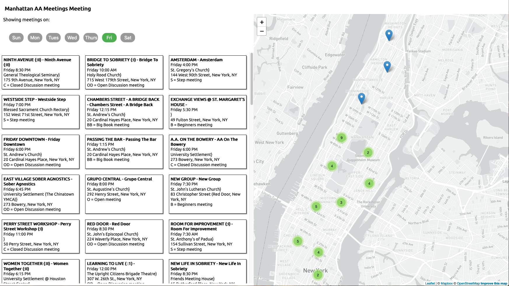

# Final Project 1: Manhattan Alcoholics Anonymous Meetings Map

In this project, our goal was to take the data presented in archived webpages for Alcoholics Anonymous meetings in Manhattan and create a functioning webmap displaying the locations and details of the meetings. An example page of the original data can be see in web page linked [here](https://parsons.nyc/aa/m08.html).

In Assignments [1](), [2](), [3](), [4](), [6](), and [7](), we processed this data by scraping it from HTML and transforming it into usable data that was stored in a PostgreSQL database.

This final assignment was a chance to take this SQL data and place it on a map to allow users to find an AA meeting.

## Notes on UX Design
When initially thinking about the design of the project in [Assignment 10](https://github.com/emilyrbowe/data-structures/tree/master/week_10), I envisioned the site automatically detecting the day of the week and showing the user the meetings that were happening on that day. I also envisioned buttons that would allow a user to toggle the desired meeting days on and off.

Those two design features were the driving elements of the project that I was able to build. There are two additional features (selecting meeting type and meeting interests) that I would have added had time allowed, but they function much the same way that the selection of the days worked, so for this implementation I am only showing the days.

Below is a screenshot of what a user would see when they land on the page. The current day of the week button is active showing only those meetings occurring on that day.

A user can then select other days, as seen in the GIF below. When a user selects another day, both the map and the sidebar showing the meeting details update.

A user can also interact with the pins on the screen to

## Notes on Technical Functionality
### SQL query

### Clustering meeting markers

### Updating the meetings based on day(s) selected
