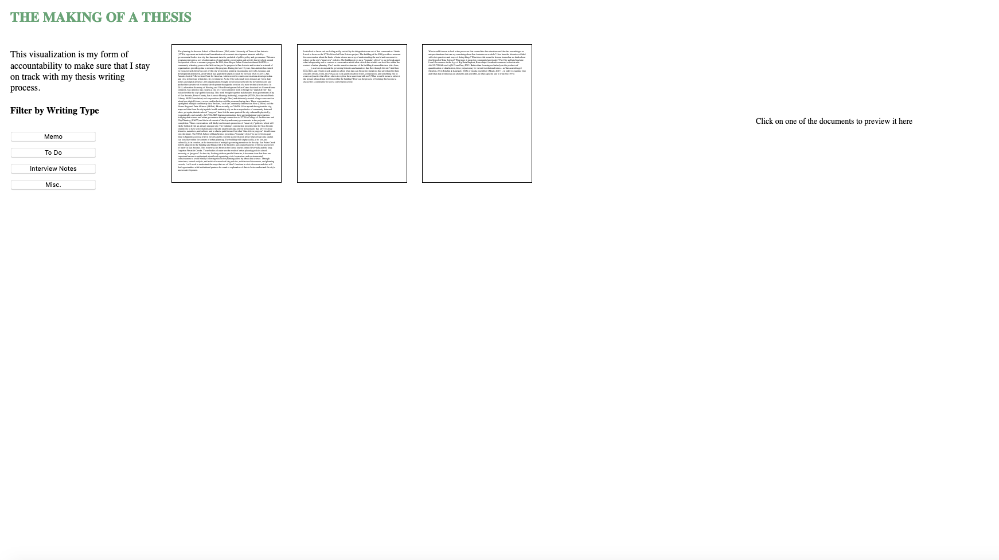
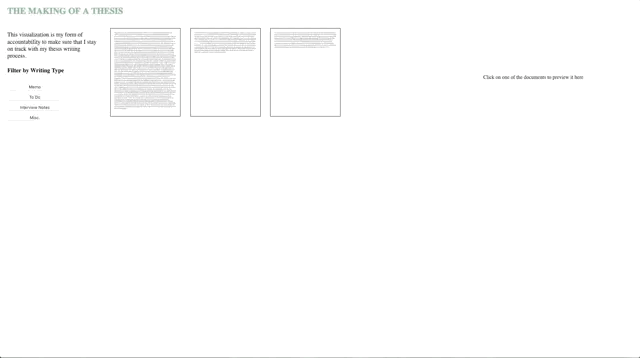

# Final Project 2: Thesis Writing Process Blog

In this project, the goal was to use a NoSQL database and write diary/blog style entries to the database that could then be retrieved.

In Assignments [5](https://github.com/emilyrbowe/data-structures/tree/master/week_05) and [6](https://github.com/emilyrbowe/data-structures/tree/master/week_06) we worked to understand how to set up a NoSQL database and then how to write, read, and query data from this database.

## [Video Walkthrough Link](https://drive.google.com/file/d/1qdYbuKQ8zeFBVIq6RM1y9eUFDQrwLxKx/view?usp=sharing)

## Notes on UX Design
Initial (and somewhat aspirational) mockups were done for [Assignment 10](https://github.com/emilyrbowe/data-structures/tree/master/week_10). The final design is simpler, but much of the same functionality is there. The two design features were the ability to filter different kinds of writing using buttons on the side and being able to see tiles of the writing pieces that could be viewed larger in a sidebar.

Below is a screenshot of the process blog when a user first lands on the page.


Showing different kinds of writing happens when a user clicks the corresponding button and is shown in the GIF below.



The "preview" functionality showing the document at a larger scale in a sidebar is shown in the GIF below.


## Notes on Technical Functionality

### Writing the data to the DB

My original experiments with NoSQL in the homework assignments had me using data that ultimately wasn't scalable for the final assignment. I also had set up the database table incorrectly, so needed to create a new table with the correct datatypes for primary key and sort key.

I chose a composite primary key that was made from the writing type (PK_category) and the date written (SK_date). The code for this is shown in [`processblog-load.js`](https://github.com/emilyrbowe/data-structures/blob/master/final_app/public/js/processblog-load.js).

### Returning data from the server with a NoSQL query
After I added data to the database, I better understood that I wanted to be able to "filter" the data by the type of writing, which further confirmed it as a choice for the primary key. In order to create a query statement for the NoSQL database, I first figured out what the `params` statement should be in order to return only a single type of writing.

I then replaced the value for `":categoryName" : {"S": ...}` in the params with a variable `${doctype}` to allow this value to change based on user selections. To control the value of this variable, I started this code with a conditional that checked to see if there was a query coming to the Express endpoint from the `pb.js` files (using the expression `if (req.query.thesisWriting != null)`). If there was no incoming query, I set the value to `"Memo"`. From there, I used a similar strategy to direct the query response objects using another conditional that ultimately outputs the data in a format that can be read by the template files.

```javascript
var doctype;

// console.log(req.query);

if (req.query.thesisWriting != null) {
    doctype = req.query.thesisWriting;
    // console.log(req.query.thesisWriting);
}
else {
    doctype = "Memo";
}
console.log(doctype);

// DynamoDB (NoSQL) query
var params = {
    TableName : "process-blog-thesis",
    KeyConditionExpression: "#cat= :categoryName", // the query expression
    ExpressionAttributeNames: { // name substitution, used for reserved words in Dynamo DB
        "#cat" : "PK_category"
    },
    ExpressionAttributeValues: { // the query values
        ":categoryName" : {"S": `${doctype}`}, //variable value that can change based on user selection
    }
};

dynamodb.query(params, function(err, data) {
    if (err) {
        console.error("Unable to query. Error:", JSON.stringify(err, null, 2));
        throw (err);
    }
    else {

        if (req.query.thesisWriting != null) {
            res.send({pbtext: data.Items})
        }
        else {
            // console.log(JSON.stringify(data.Items));
            res.end(pbtemplate({
                pbdata: JSON.stringify(data.Items),
                pbtext: data.Items
            }));
        }
        console.log('3) responded to request for process blog data');
    }
});
```

### Sending query from front end to app.js
The user interacts with the project using the buttons on the front end to filter the resulting data that is returned. The code that controls this is in the pb.js file, shown in part below. An onclick jQuery function adds a class of "active" to the button that was most recently clicked and then calls the `showTexts()` function, which sets the parameter value `thesisWriting` and sends it to the Express app to get a response data value.

``` javascript
var writingType;

$(document).ready(function() {
  $(".btn").on('click', function(e) {

    $(this).addClass("active");
    $(this).siblings().removeClass('active')

    if (this.classList.contains('active')) {
      writingType = $(this).attr("id");
    }
    showTexts(writingType)
  });
});

function showSidebar(el) {
  $(el).addClass("selected");
  $(el).siblings().removeClass('selected')
  let sidebarContent = ($(el).html())
  $('#viewer').html(`${sidebarContent}`);
};

function showTexts(writingType) {
  var parameters = {
    thesisWriting: writingType,
  };

  console.log(parameters);

  //getting server endpoint
  $.get('/processblog', parameters, function(data) {
    ...
  })
};

```

### Templating response values
The response value from the Express app is sent to the template as `pbtext` and is templated in both the TXT file and the pb.js file. The first code snippet is found inside of the div element with the id "myWriting".

``` javascript
{{#each pbtext}}
  <div class="writing" onclick="showSidebar(this)">
    {{entry.S}}
  </div>
{{/each}}
```
This second code snippet is found at the end of the pb.js file as the response to the `$.get()` command communicating with the Express endpoint. The data is being returned and looped over to create each thumbnail in the gallery.

``` javascript
$.get('/processblog', parameters, function(data) {
  console.log(data);
  let content = '';
  // console.log(data.pbtext);
  // data = data.pbtext;
  for (var i = 0; i < data.pbtext.length; i++) {
    content +=
      `
      <div class="writing" onclick="showSidebar(this)">
          ${data.pbtext[i].entry.S}
      </div>
      `
  };
  // console.log(content);
  $('#myWriting').html(`${content}`);
  $('#viewer').html('Click on one of the documents to preview it here');
})
```

### Toggling visiblity for writing samples
The last part of the that required some work was controlling the visibiility of the texts when a user clicked on the small thumbnail. This was achieved through an onclick function for each `<div>` containing the thumbnail content. The function `showSidebar()` is run on click and sends the HTML value of the original `<div>` to the `#viewer` element to replace its HTML content.

``` javascript
function showSidebar(el) {
  $(el).addClass("selected");
  $(el).siblings().removeClass('selected')
  let sidebarContent = ($(el).html())
  $('#viewer').html(`${sidebarContent}`);
};
```
