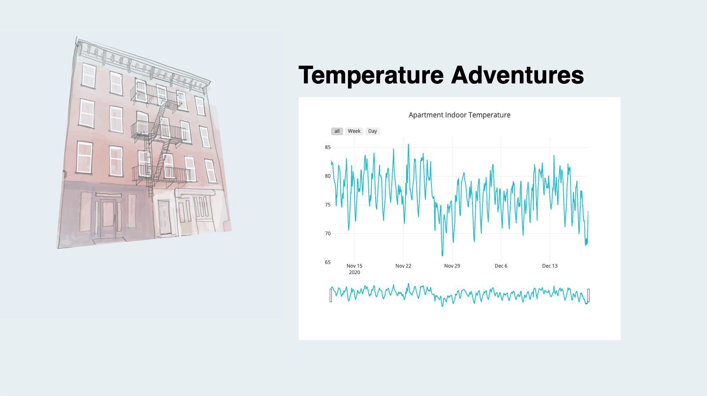
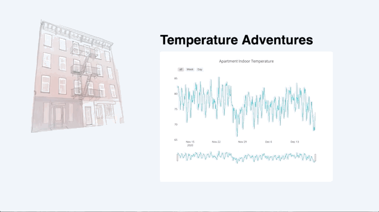

# Final Project 3: Temperature Sensor Interface

This project explored the use of a temperature sensor to write temperature and humidity data to a PostgreSQL database and then

Initial work for the sensor setup and data processing was done in Assignment [8](https://github.com/emilyrbowe/data-structures/tree/master/week_08) and covered the writing of data to the database at 5 minute intervals.
https://drive.google.com/file/d/1M6m44X9zBHjXQ4hiD_QrQHzN5OpXTNme/view?usp=sharing)

## Notes on UX Design
An earlier mockup for this project was done in [Assignment 10](https://github.com/emilyrbowe/data-structures/tree/master/week_10). The ultimate design has been reduced to a single page, but the core of the temperature visualization is present.


I was interested in having a graph that didn't restrict a user to one "level" of viewing the data. I wanted to be able to zoom in to the level of a single day, but also to see multiple weeks of data at the same time. I was able to achieve this by using a library built on top of D3 called Plotly.


## Notes on Technical Functionality
### SQL Query
In order to make thousands of datapoints more reasonable to graph with, I made the decision to create an average value for each hour measured. The SQL query that did this is shown below. Also of note is the transformation of the time value from a full time to just the hour (and also the switch from UTC time to EST). I also noticed after using the data that there were outlier values that were obviously the result of a sensor malfunction, so I bounded the returned sensor temperature values between 0 and 100 degrees Fahrenheit.

``` javascript
var temp = `SELECT date_trunc('hour', ((compTime AT TIME ZONE 'UTC') AT TIME ZONE 'EST')) as sensordayhour, AVG(sensorValue) as avgHourVal
 FROM sensorData
 WHERE sensorValue < 100 AND sensorValue > 0 AND measureType = 'temp'
 GROUP BY sensordayhour
 ORDER BY sensordayhour;`;
```

### Temperature plot
The code used to send the the resulting data to the front end template is shown below.

``` javascript
client.query(temp, (qerr, qres) => {
    if (qerr) { throw qerr }
    else {
        res.end(temptemplate({ sensordata: JSON.stringify(qres.rows)}));
        client.end();
        console.log('1) responded to request for sensor graph');
        // console.log(qres.rows);
    }
});
```
The Plotly chart was generated by modifying code from the documentation for a timeseries plot with time slider. That code is shown below and is inserted as a script into the TXT template file.

``` javascript
//Time Series plot based on https://plotly.com/javascript/time-series/#time-series-with-rangeslider

var sensorData = {{{sensordata}}};

  Plotly.d3.csv("", function(err, rows){

  function unpack(rows, key) {
  return rows.map(function(row) { return row[key]; });
  }


var temp = {
  type: "scatter",
  mode: "lines",
  name: 'Temperature',
  x: [],
  y: [],
    line: {color: '#17BECF'}
  }

for (let i=0; i<sensorData.length; i++){
  temp.x.push(sensorData[i].sensordayhour);
  temp.y.push(sensorData[i].avghourval);
}

var data = [temp];

var layout = {
  title: 'Apartment Indoor Temperature',
  xaxis: {
  autorange: true,
  range: ['2020-11-17', '2020-12-12'],
  rangeselector: {buttons: [
      {step: 'all'},
      {
        count: 7,
        label: 'Week',
        step: 'day',
        stepmode: 'backward'
      },
      {
        count: 1,
        label: 'Day',
        step: 'day',
        stepmode: 'backward'
      }
    ]},
  rangeslider: {range: ['2020-11-17', '2020-12-12']},
  type: 'date'
},
yaxis: {
  autorange: true,
  range: [65, 90],
  type: 'linear'
}
};

Plotly.newPlot('tempplot', data, layout);
})
```
