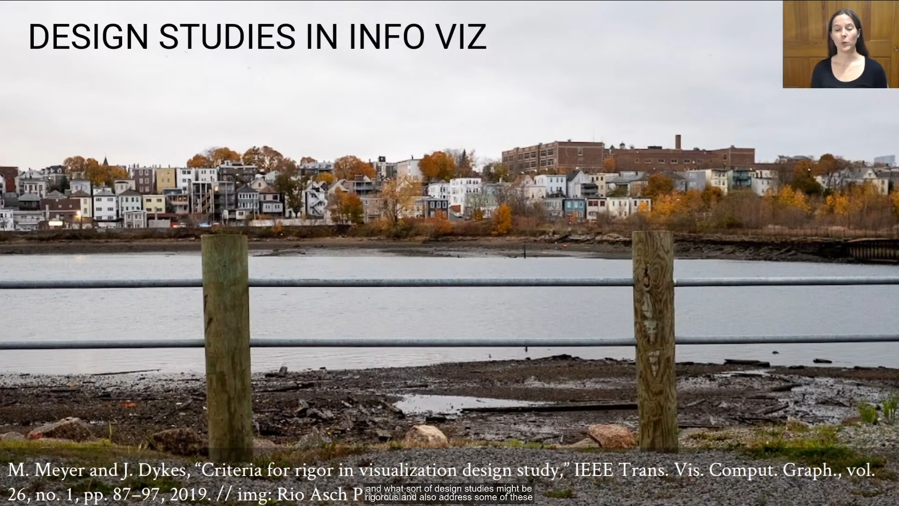
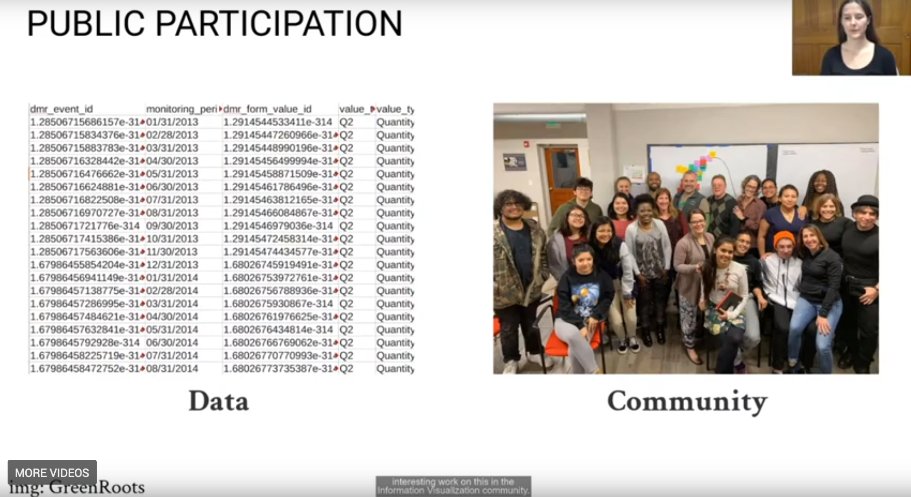
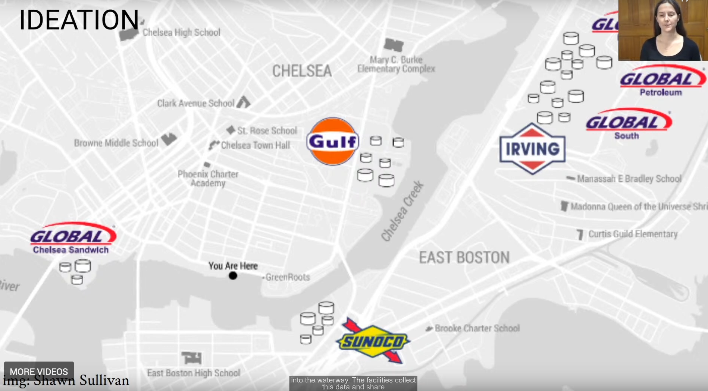
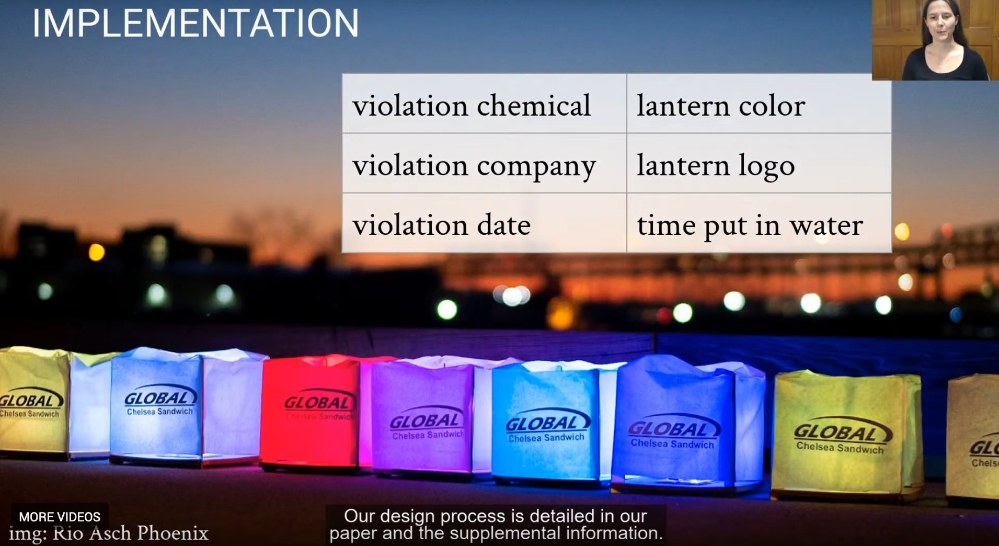
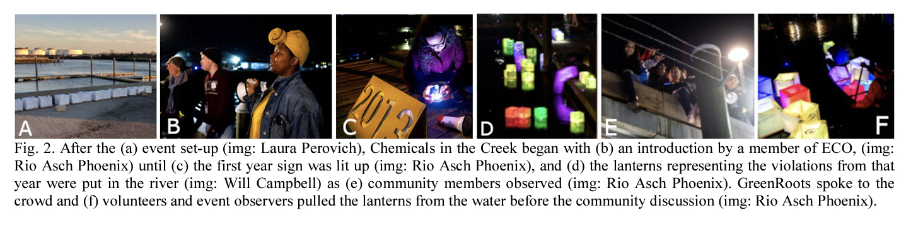
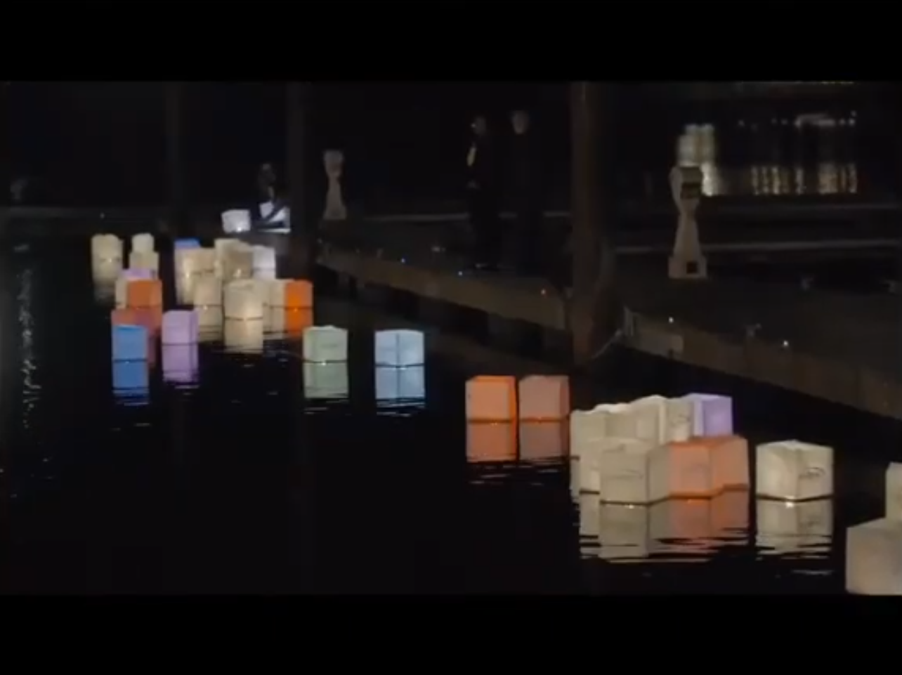
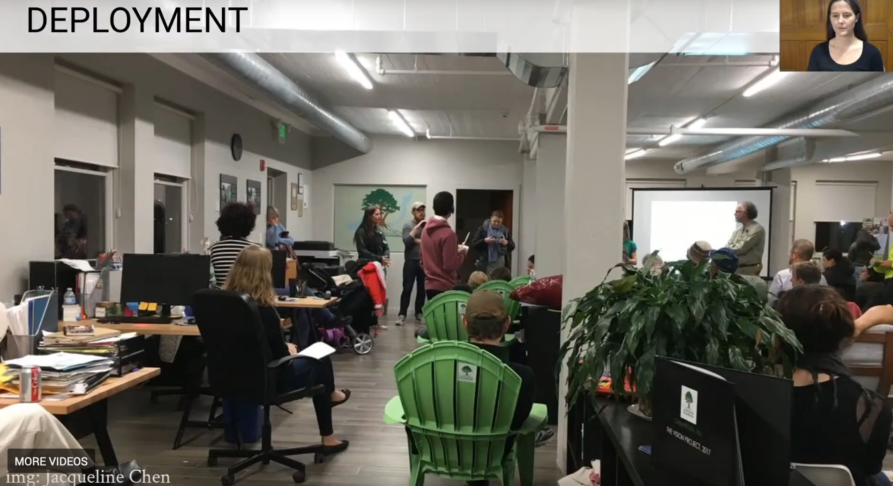

### IEEE Vis 2020 Paper Summary

#### ["Chemicals in the Creek: designing a situated data physicalization of open government data with the community"](https://ieeevis.b-cdn.net/vis_2020/pdfs/f-info-1210.pdf)
Authors: Laura Perovich, Sara Wylie, Roseann Bongiovanni

This paper details the process used by researchers in Chelsea, Massachusetts to create a community-driven data visualization and physicalization process, based off of water permit violsations data from the US Environmental Protection Agency. After two years of work using participatory action research (PAR) methods, the team created the Chemicals in the Creek installation, which focused specifically on the water quality near oil storage facilities on Chelsea Creek.

This process brought together two researchers from Northeastern University with a researcher at Greenroots, a community group focused on environmental justice work. The researchers were committed to exploring what kinds of experiences the public has with open data, such as the kind released by the EPA. Though a typical process might begin with available datasets, they began by talking to community members about what issues concerned them and began to explore what opportunities for intervention might exist given available data. In this way, the team sought to use PAR methods of "'researchers and participants working together to examine a problematic situation or action to change it for the better' [40]" (2). This way of working allowed them to critically examine issues of power and justice with, rather than for, a local constituency.

In keeping with this, first phase of the multi-year work was building releationships and ideation. The partnership with Greenroots led to working closely teenagers involved in Greenroots' environmental outreach. Throuhg community workshops and information gathering, the group focused on concerns about the 7 oil storage facilities located along Chelsea Creek. With additional work, the research team discovered that from 2013-17, there were 76 violations reported by these oil facilities to the EPA and these violations measured 8 different chemicals. From here, the researchers clarified their research question to be: "How can we make these water quality permit violations by oil industries on the Chelsea Creek visible, udnerstandable, and actionable for the community?"

Interested in previous work on data physicalization, the team decided to create an event-based installation that would involve elements of performance to achieve both data visualization and physicalization. They created floating lanterns that would represent a single violation, with a painted-on logo to show the company and a color to show the violation chemical. These lanterns would then be released during the event in the order that the violations happened. After the Chemicals in the Creek event, which took place during a Greenroots community meeting, the particpants returned for a discussion that allowed for more reflection of the process and outcome.

In the paper, the researchers reflected on seven key elements of the project: community experience, affective understanding, physical interaction with displays, performativity, the social experience, PAR in the project, and PAR for future methodologies challening existing power relationships (8-9).

Images from the presentation and the paper:

