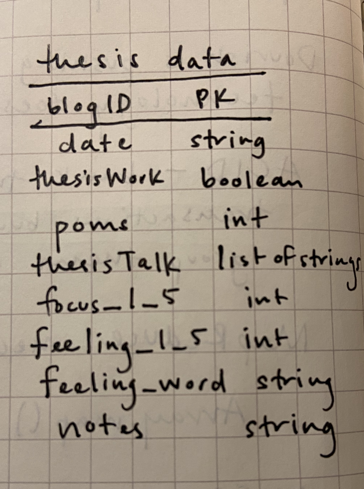
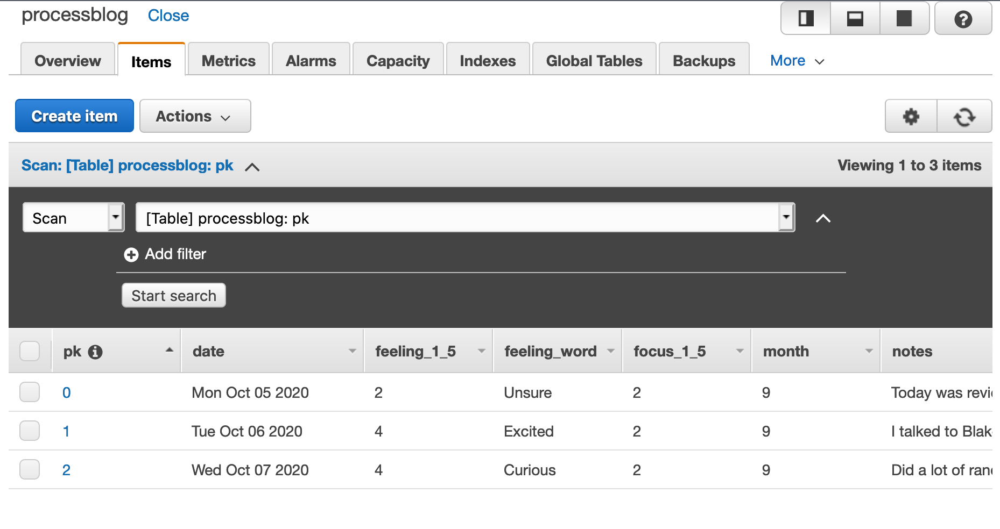

# Week 5 Assignment
#### Due: OCtober 6, 2020 6pm

## Objective: Create data for the "process blog" assignment

In this assignment, I was asked to create a database using Amazon DynamoD and then create a table structure and write data to this database.

------

## Starter Code
We were given starter code for the assignment, which is shown below.

This first bit of code is for creating and structuring the code within the database.

### Part 2: Create some data for the table in your database
```javascript
var blogEntries = [];

class BlogEntry {
  constructor(primaryKey, date, entry, happy, iate) {
    this.pk = {};
    this.pk.N = primaryKey.toString();
    this.date = {};
    this.date.S = new Date(date).toDateString();
    this.entry = {};
    this.entry.S = entry;
    this.happy = {};
    this.happy.BOOL = happy;
    if (iate != null) {
      this.iate = {};
      this.iate.SS = iate;
    }
    this.month = {};
    this.month.N = new Date(date).getMonth().toString();
  }
}

blogEntries.push(new BlogEntry(0, 'August 28 2019', "Yay, first day of class!", true, ["Cheez-Its", "M&Ms"]));
blogEntries.push(new BlogEntry(1, 'October 31, 2015', "I piloted my first solo flight!", true, ["pancakes"]));
blogEntries.push(new BlogEntry(2, 8675309, "867-5309?", false));
blogEntries.push(new BlogEntry(3, 'September 25, 2019', "I taught my favorite students.", true, ["peas", "carrots"]));

console.log(blogEntries);
```

The second bit of the code is to populate the database.

``` javascript
var AWS = require('aws-sdk');
AWS.config = new AWS.Config();
AWS.config.region = "us-east-1";

var dynamodb = new AWS.DynamoDB();

var params = {};
params.Item = blogEntries[0];
params.TableName = "processblog";

dynamodb.putItem(params, function (err, data) {
  if (err) console.log(err, err.stack); // an error occurred
  else     console.log(data);           // successful response
});
```
------

## Process Documentation

To begin, I started be exploring the API's response to testing data, knowing that parsing this data would be the first step towards extracting the latitude and longitude from the response.

### Part 1: Plan
My sketch for my NoSQL database is shown below:



### Part 2: Create some data for the table in your database
I began by create the `BlogEntry` class that I knew I would need in order to match my plan for the database.

```javascript
var blogEntries = [];

class BlogEntry {
  constructor(primaryKey, date, thesisWork, poms, thesisTalk, focus_1_5, feeling_1_5, feeling_word, notes) {
    this.pk = {};
    this.pk.S = primaryKey.toString();

    this.date = {};
    this.date.S = new Date(date).toDateString();

    //thesisWork is a boolean answering the question "Did you work on your thesis today?"
    this.thesisWork = {};
    this.thesisWork.BOOL = thesisWork;

    //poms is a number answering the question, "Roughly how much time (in poms) did you spend on thesis today?"
    if (poms != null) {
      this.poms = {};
      this.poms.N = poms.toString();
    }

    //thesisTalk is a list containing strings of people who I spoke to that day
    if (thesisTalk != null) {
      this.thesisTalk = {};
      this.thesisTalk.SS = thesisTalk;
    }

    //focus_1_5 is a number answering the question, "On a scale of 1-5, with 1 being 'Not Very Focused' and 5 being 'Very Focused', how focused did you feel? "
    if (focus_1_5 != null){
      this.focus_1_5 = {};
      this.focus_1_5.N = focus_1_5.toString();
    }

    //feeling_1_5 is a number answering the question, "On a scale of 1-5, with 1 being 'Feeling Badly' and 5 being 'Feeling Great', how do you feel about your thesis right now?"
    if (feeling_1_5 != null){
      this.feeling_1_5 = {};
      this.feeling_1_5.N = feeling_1_5.toString();
    }

    //feeling_word is a word representing the answer to the question, "How do you feel about your thesis right now?"
    if (feeling_word != null){
       this.feeling_word = {};
      this.feeling_word.S = feeling_word;
    }

    //notes is a string that contains any notes that were relevant for the day
    if (notes != null) {
      this.notes = {};
      this.notes.S = notes;
    }
    this.month = {};
    this.month.N = new Date(date).getMonth().toString();
  }
}

//(primaryKey, date, thesisWork, poms, thesisTalk, focus_1_5, feeling_1_5, feeling_word, notes)
blogEntries.push(new BlogEntry(0, 'October 5, 2020', true, 8, ["Miguel", "Miodrag", "Bill"], 2, 2, "Unsure", "Today was review day and it didn't go well. Left the review feeling drained and like my project was doomed. Am considering switching away from SA."));
blogEntries.push(new BlogEntry(1, 'October 6, 2020', true, 4, ["Blake", "Amy"], 2, 4, "Excited", "I talked to Blake and felt much more reassured about where I am in the process. And my chat with Amy left me feeling so much better about my initial insticts about following water and planning processes in San Antonio."));
blogEntries.push(new BlogEntry(2, 'October 7, 2020', true, 3, ["Shannon"], 2, 4, "Curious", "Did a lot of random googling today and watched part of a recording of a SAWS board meeting, which was fascinating. Talked to Shannon, which was also incredibly clarifying."));

```

### Part 3: Populate your database

Using the starter code, I was able to add a single blog post. I knew that I would actually have to iterate over the `blogEntries` array. In order to do that, I added the `async` module as a required npm package and was able to modify the starter code to push the value into the `processblog` table in DynamoDB.

```javascript
var AWS = require('aws-sdk');
AWS.config = new AWS.Config();
AWS.config.region = "us-east-1";

var dynamodb = new AWS.DynamoDB();

var params = {};
params.TableName = "processblog";
// params.Item = blogEntries[0];

// eachSeries in the async module iterates over an array and operates on each item in the array in series
async.eachSeries(blogEntries, function(value, callback) {
    params.Item = value;

    // console.log(value.date);

    dynamodb.putItem(params, function (err, data) {
      if (err) console.log(err, err.stack); // an error occurred
      else     console.log(`Blog posted`);           // successful response
    });

    // sleep for a couple seconds before making the next request
    setTimeout(callback, 2000);
}, function() {
    console.log('*** *** *** *** ***');
    console.log(`Number of blog posts added: ${Object.entries(params).length}`);
});
```

Once I updated my code using the `async` module, I was able to load each blog post entry into the table, as shown below:



### Success! 👾
