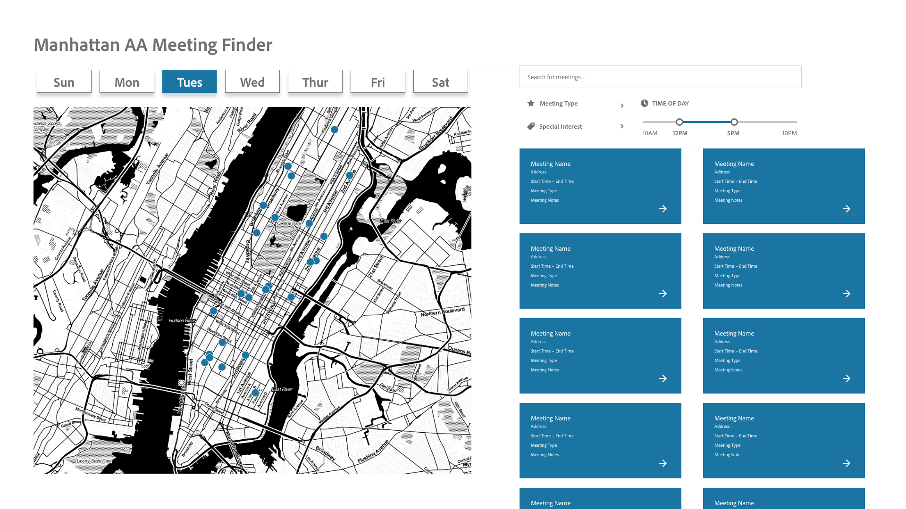

# Week 8 Assignment
#### Due: November 17, 2020 6pm

## Objective: Create mockups for final projects

### Final Project 1: AA Meeting Finder

* **What will the visualization look like? Will it be interactive? If so, how?**
An initial wireframe for the AA Meeting Finder is shown below. The buttons across the top will show different meetings on various days of the week, with each button having a different color that corresponds to dots on the map.

Selecting a different day than the current day will lead to a view like the following image.

* **How will the data need to be mapped to the visual elements?**
The data will be queried based on the days that are selected and the filtering options on the side. The data that matches these queries will be shown on the map.

* **For that mapping, what needs to be done to the data? Be specific and clear. Will it require filtering, aggregation, restructuring, and/or something else? How will this be done?**
The data will require filtering to meeting the queries for day of the week, meeting type, special interests, and time of day. These will require separate SQL queries that can get submitted to the database and will be reflected on the map.

* **What is the default view (if any)?**
The default view is will be for the current day.

* **What assumptions are you making about the user?**
I am making the assumption that a primary use for the site would be finding a same-day AA meeting.

### Final Project 2: Process Blog

* **What will the visualization look like? Will it be interactive? If so, how?**
I am using this project as motivation for producing ample writing for my thesis, by "visualizing" the writing I have done to date. I am heavily basing this design off of the visualization of Open Street Map contributors in [Wonyoung So's "Cartographers of North Korea"](https://cartographers-nk.wonyoung.so/).The views for my project's visualization are shown below.

This next screenview is of a filter being applied showing matching texts and a single text selected for viewing.

* **How will the data need to be mapped to the visual elements?**
The visualization will show each piece of writing as a block with very tiny (pretty much illegible) text. As various filters and options are selected from the sidebar, the matching text will be highlighted.

* **For that mapping, what needs to be done to the data? Be specific and clear. Will it require filtering, aggregation, restructuring, and/or something else? How will this be done?**
This will be the most difficult part of the project: completely re-factoring the database and dataset to reflect the new direction for the project. I already have the writing saved and dated on other parts of my comptuer, but I will need to design a new DynamoDB to be able to hold this data and be filtered by various things. I imagine the sort key for this dataset will be the date written + the writing type, but this is a piece of the project I need to figure out.

* **What is the default view (if any)?**
The default view is shown in the screenshot above.

* **What assumptions are you making about the user?**
The user for this is pretty much only me and I'm interested in being able to reflect on my own writing process in a way that sees all progress along the way.

### Final Project 3: Sensor Data

* **What will the visualization look like? Will it be interactive? If so, how?**
The landing page for the project is shown below. I am imagining the project being rooted in my building (hence my illustration) and helping to explain the nuances of indoor vs. oudoor temperatures, particularly in old New York apartment buildings. Another link will lead people to information about winter indoor heat requirements in NYC.

The page showing sensor temperature and humidity data will also show the current temperature and humidity, along with information about the sensor that is collecting the data.

* **How will the data need to be mapped to the visual elements?**
The data will need to be viewed in a bar chart over time, possibly viewable by hour or day (or time in a specific day). (I would need to add this into the design, as it's not currently shown.)

* **For that mapping, what needs to be done to the data? Be specific and clear. Will it require filtering, aggregation, restructuring, and/or something else? How will this be done?**
The data will need to be aggregated based on selections for hour/day. It will also need to be filtered based on whether the datapoint is for temperature or humidity.

* **What is the default view (if any)?**
The default view is the homepage with the building image.

* **What assumptions are you making about the user?**
I am assumign the user is interested in seein
