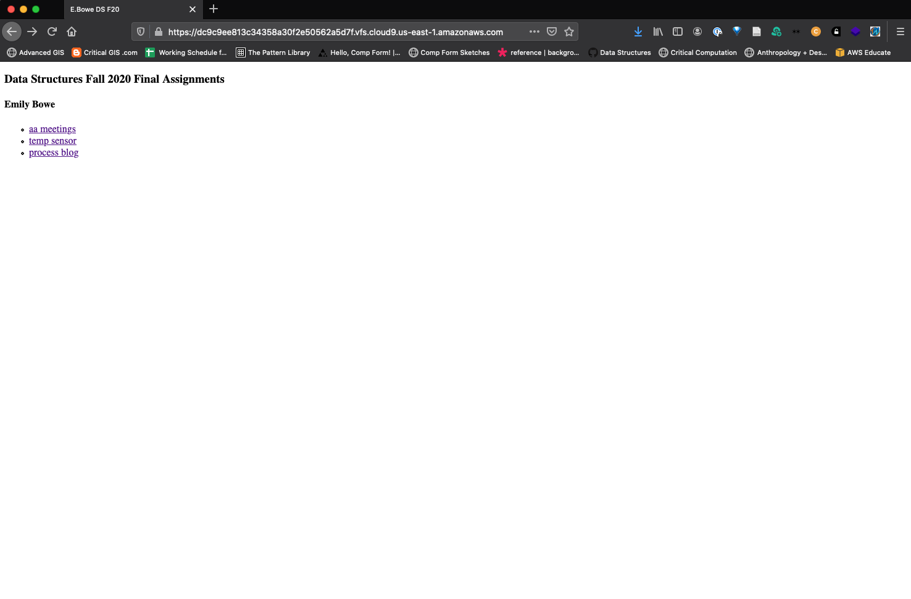
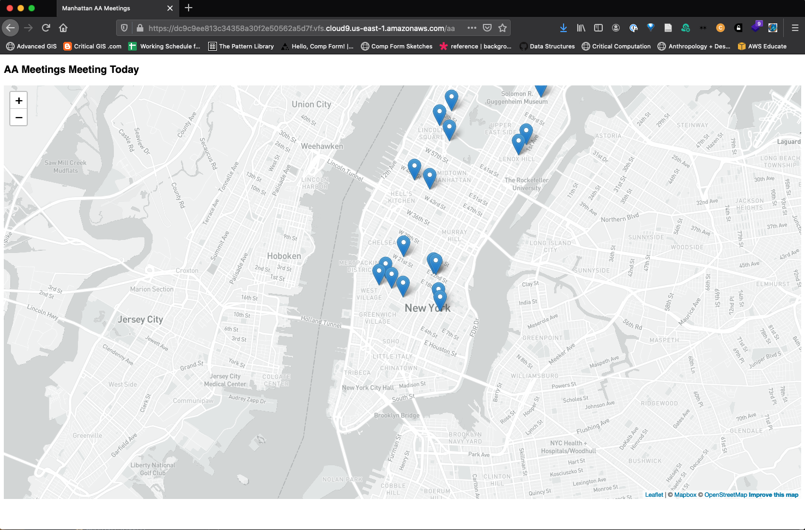
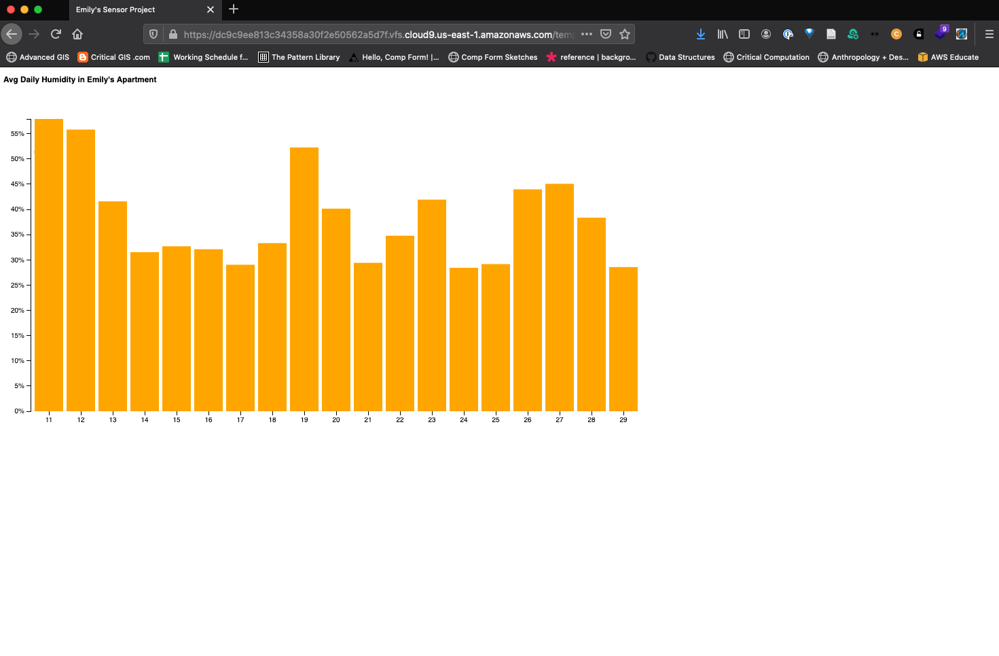
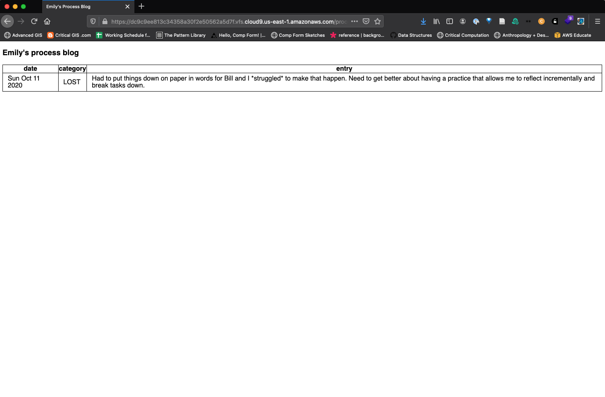

# Week 11 Assignment
#### Due: December 1, 2020 6pm

## Objective: Final app demo for Assignments 1, 2, and 3

The live app can be reached at [this link](https://dc9c9ee813c34358a30f2e50562a5d7f.vfs.cloud9.us-east-1.amazonaws.com/). The screenshot below shows what the root directory page looks like before clicking into any of the three project pages.

### Assignment 1: [AA Meetings](https://dc9c9ee813c34358a30f2e50562a5d7f.vfs.cloud9.us-east-1.amazonaws.com/aa)

Getting the project page working for Assignment 1 was by far the most difficult part of the assignment, as there were a variety of issues in SQL that I had to troubleshoot from the starter code. The final demo page is shown in the screenshot below. I've also noted the changes I had to make to the code.

1. **Creating an `.env` file inside the `final_app` folder**: Without doing this, the code would fail because the database connection couldn't be established. The `dotenv` package relies on the `.env` file being in the same directory as the code being run, and my `.env` file from past assignments was in the directory above.
2. **Adding environment configuration**: I had to add one line of code – `dotenv.config()` – into my `app.js` file on line 17 in order to get the database credentials to work.
3. **Adding an array to get day name**: In the original code, the current day is determined using `now.day()` and then used to filter the AA meetings in an SQL query. The only problem was that I stored the meeting day as the name of the day (e.g. "Sunday") and `now.day()` gives an integer value(0-6). I had to create an array that could hold the names of days and then a line that would use the integer index of the day name array to get the query value.
4. **Query string issue with single quotes**: I got pretty stumped by this until I finally looked at the SQL documentation. In the original query string, the WHERE clause is written ``...WHERE mtgday = ` + dayyName + `...``. I kept getting errors about "Sunday" not being a valid column name, which is when I realized that the `dayyName` variable needed to wrapped in single quotes in the query in order for SQL to know what was doing on. It took me a while to figure out that single quotes would have to be written with escape characters (`WHERE mtgday = + '\'' + dayyName + '\''`) in order to be read.
5. **Hiding the Mapbox Access Token**: The original code exposes the Mapbox access token, so I rewrote the injected javascript for the AA map to keep the access token in the `.env` file. This also required rewriting the response in line 100 and breaking the `jx` code into two snippets.

### Assignment 2: [Sensor Data](https://dc9c9ee813c34358a30f2e50562a5d7f.vfs.cloud9.us-east-1.amazonaws.com/temperature)

The sensor data was much easier to get working. This is the screenshot of the demo app page.

I had to divide the humidity sensor value by 100 before it was handled by D3 because the D3 data type was `percent`, which automatically multiplies a value by 100 and adds a '%' sign.

### Assignment 3: [Process Blog](https://dc9c9ee813c34358a30f2e50562a5d7f.vfs.cloud9.us-east-1.amazonaws.com/processblog)

Finally, this is the screenshot from the process blog. Right now it's using dummy data, which is why there is only one entry that matches the query results. This will be fixed in the final project.

